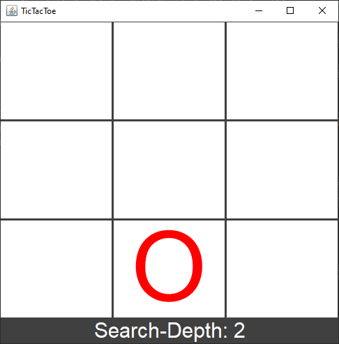

# Tic Tac Toe

------------------

Play TIc Tac Toe against the computer! The computer starts with doing just random moves, but after each time you defeat it, it will increase its search depth to find the best move. If the computer manages to beat you, the search depth gets decreased again.
 
 

### You need at least Java SE 15 to run the jar

------------------

You can get the newest version here: https://www.oracle.com/java/technologies/downloads/